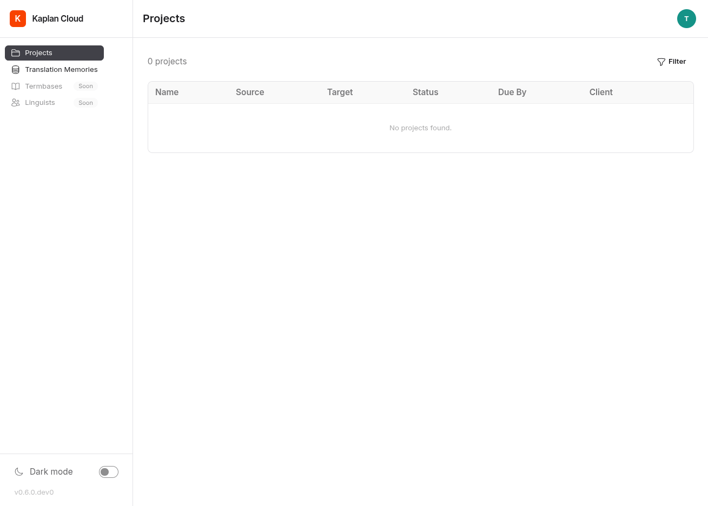

Projects
========

After signing in, the project list is your home page. This page covers
the project list and the project detail view from a translator or
reviewer perspective — for creating projects yourself, see
:doc:`creating-projects`.

The project list
----------------

The landing page at ``/`` shows every project you are involved in. A
project appears in your list if any of the following is true:

- You are a member of the client team the project belongs to.
- You created the project (PM workflow).
- You are assigned as translator or reviewer on at least one of its
  files.

Each row shows the project's name, source and target languages,
client, due date, and current status. Status flows from **Preparing**
through **Ready for Analysis**, **Analyzing**, **Ready for
Translation**, **In Translation**, **In Review**, **Complete**, and
**Delivered**. (You may also see **Error** if file ingestion failed.)

The project detail page
-----------------------

Clicking a project takes you to ``/project/<uuid>``. The header shows
project metadata; below it is a table of files, each with its own
status that follows the same lifecycle as the project itself.

For each file you'll see:

- The original filename and source-language file size.
- The current status badge.
- Who, if anyone, is assigned as translator and reviewer.
- A row action to open the file in the editor — see :doc:`editor`.

Files appear as **Ready for Translation** once the project's initial
analysis is complete. A file you are assigned to as a translator will
move to **In Translation** the first time you open it; when you finish,
it goes to **In Review** for your reviewer, and finally to
**Complete**.

Reference files
---------------

If the PM uploaded reference material (style guides, glossaries,
brand assets) alongside the source files, they appear in a dedicated
section on the project page. Click any reference file to download it.
Reference files are read-only — they don't go through the segment
editor.
