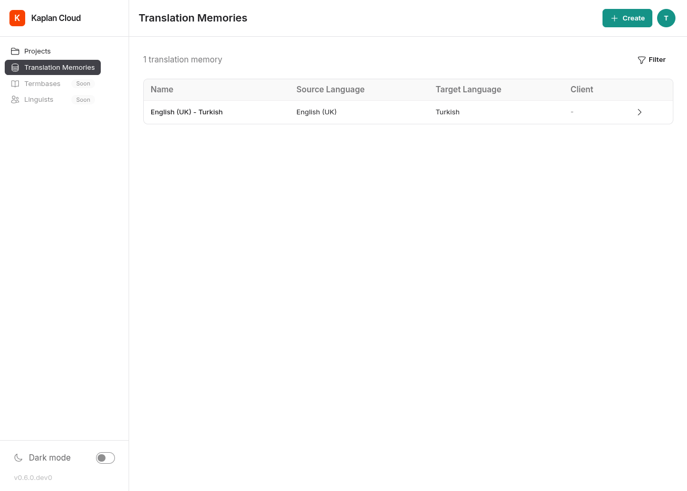

Translation memories
====================

A translation memory (TM) is a store of previously-translated segment
pairs (source + target text). When a PM attaches a TM to a project,
the editor surfaces matching past translations as the linguist works.
Over time, your team builds up TMs per client or per domain and
re-uses them on new projects.

This page covers the TM screens. For how matches appear during
translation, see :doc:`editor`.

The Translation Memories list
-----------------------------

Visit ``/translation-memories`` to see every TM you have access to.
PMs and administrators see all TMs they manage; other users see TMs
they can use via the client teams they belong to.

Each row shows the TM's name, language pair, the client it belongs
to (if any), and a row action to open its detail page.

Create a TM (PM only)
---------------------

1. From the TM list, click **Create** to open the new TM form at
   ``/translation-memory/new``.

   .. image:: ./_static/img/translation-memory-form.png
      :alt: Translation memory form

2. Fill in the form:

   - **Name** — short, descriptive (e.g. ``Acme legal EN→FR``).
   - **Source language** and **target language** — both must already
     exist as :doc:`language profiles <language-profiles>`. If the
     language you need is missing, ask an admin to add it first.
   - **Client** — optional; scope the TM to a single client's team.

3. Submit. The new TM is empty until you import content or run a
   project against it.

Import existing translations
----------------------------

On a TM's detail page, the **Import** action at
``/translation-memory/<uuid>/import`` accepts ``.tmx`` files (the
industry-standard Translation Memory eXchange format). Uploading a TMX
file appends its segment pairs to the TM.

Use TMs in a project
--------------------

When creating a project (see :doc:`creating-projects`), select one or
more TMs from the list of TMs you have access to. The project analysis
runs every segment of every source file against those TMs and records
matches in the analysis report; the editor surfaces those same matches
live as the linguist works.
